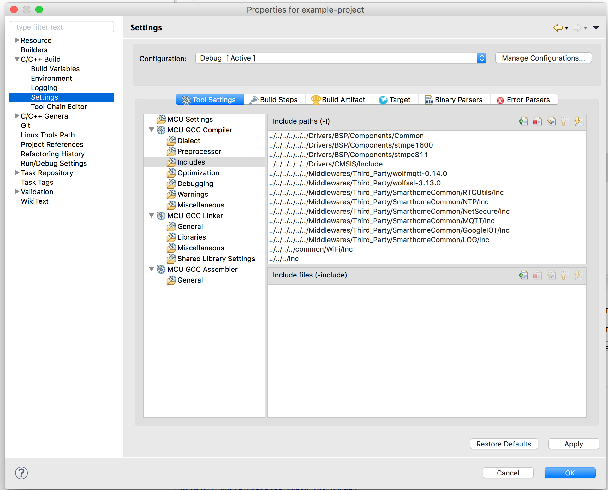
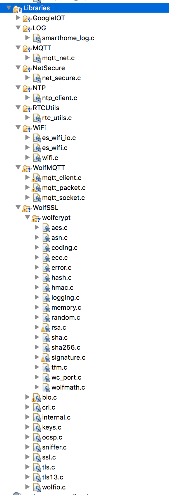

# Static Smarthome Common
Commonly used libraries, know-hows by Aventurin and Fuchsit projects. These libraries are tested on STM32L4 IoT Discovery and STM32F7 Disocvery boards using System Workbench IDE.

# Summary

The library methods are well documented in the code, so in the README files you can see just some examples for usage.

| Link | Summary | Dependencies |
|------|---------|--------------|
| [LOG](LOG/README.md) | Very basic logging library which wraps the logging method and logs the messages with printf | none |
| [NetSecure](NetSecure/README.md) | This library tries to unify the network communication in both projects. Built on WolfSSL and provides easy usage of the basic network use-cases on a unified way. The IP stack specific implementations are in the actual projects. | [LOG](LOG/README.md), [WolfSSL 3.13.0](https://github.com/wolfSSL/wolfssl/tree/v3.13.0-stable) |
| [NTP](NTP/README.md) | A basic library, which is able to connect to an NTP server through UDP and gets the current timestamp | [NetSecure](NetSecure/README.md), [LOG](LOG/README.md) |
| [MQTT](MQTT/README.md) | Helper library, which implements the WolfMQTT network callbacks using our NetSecure library. | [NetSecure](NetSecure/README.md), [LOG](LOG/README.md), [WolfMQTT 0.14.0](https://github.com/wolfSSL/wolfMQTT/tree/v0.14) |
| [RTCUtils](RTCUtils/README.md) | This library helps to initialize the RTC on the board and provides functions to be able to set the RTC clock based on UNIX timestamp or get UNIX timestamp from the RTC clock. | [LOG](LOG/README.md), [NetSecure](NetSecure/README.md) |
| [GoogleIOT](GoogleIOT/README.md) | This library wraps the MQTT functionality and helps the connection to the Google IoT Core MQTT broker. | [LOG](LOG/README.md), [NetSecure](NetSecure/README.md) |

# Usage

Most of the libaries are depending on [WolfSSL 3.13.0](https://github.com/wolfSSL/wolfssl/tree/v3.13.0-stable) and [WolfMQTT 0.14.0](https://github.com/wolfSSL/wolfMQTT/tree/v0.14), so the safest way to make this work is to start with including these libraries.

## Steps to use the libraries in System Workbench

Generally you should go through the following steps to include a library in your project:

### 1. Get the library's source code under **STM32Cube_XX_XXX/Middlewares/Third_Party** folder:

```bash
cd STM32Cube<board type and version>/Middlewares/Third_Party
git clone https://github.com/wolfSSL/wolfssl
git clone https://github.com/wolfSSL/wolfMQTT
git clone https://github.com/greenfox-academy/static-smarthome-common SmarthomeCommon
```

### 2. Add the library's headers to the project path

Now you need to add the headers to the include path of your project. To make sure that others will be able to use your project as well it's recommended to use **relative paths** during inclusion instead of **absolute path**. This way only the folder structure of the **STM32CubeXX** matters.

In System Workbench you can extend the include paths as follows:

1. Right click on the project, select **Properties**
2. On the left bar expand **C/C++ Build** and select **Settings**
3. Under **MCU GCC Compiler** select **Includes**
4. Click on the **Add...** button to add a directory. Follow the scheme (lots of ../../) to refer to the directory which contains the header files. The starting point is the directory where your project's **.project** file is located.

After adding WolfSSL, WolfMQTT and all the libraries above, your list should look something like this:



### 3. Add the libraries' source files

Now you need to add the library sources as well to make them compiled with your project. To keep your project organized, it's recommended to create a folder in your project called **Libraries**. (Right click on the project, new folder... etc.).

I used to create a subfolder under this folder for each library to keep it well organized. Under the specific subfolder you can add the library's source files.

It's important that you need to use file links instead of actual files, and in these links you need to use relative paths as well. You can use the **PROJECT_LOC** variable for starting point, which points to the folder in which your **.project** file is. So the steps of linking a single file is:

1. Right click on the folder in which you'd like to link the source file
2. Select **New->File**
3. In the dialog click **Advanced >>**
4. Check the **Link to file in the file system** checkbox
5. In the appearing input box start typing **PROJECT_LOC/../..** and on the top of the dialog you can see where your link points to.
6. Extend the path to refer to a **.c** file and click finish. In my case to include the **LOG** library's **.c** file the path looks like this:

```bash
PROJECT_LOC/../../../../../Middlewares/Third_Party/SmarthomeCommon/LOG/Src/smarthome_log.c
```
7. Repeat this with all the necessary source files.

In my project in the end the project's directory tree looks like this:



### 4. You're ready

Now you can include the header files and use the libraries. For example using the **LOG** library:

```c
#include "smarthome_log.h"

void main() {
    SHOME_DebugEnable();

    int i = 100;
    SHOME_LogMsg("This is my log message. %d percent perfect!\r\n", i);
}
```